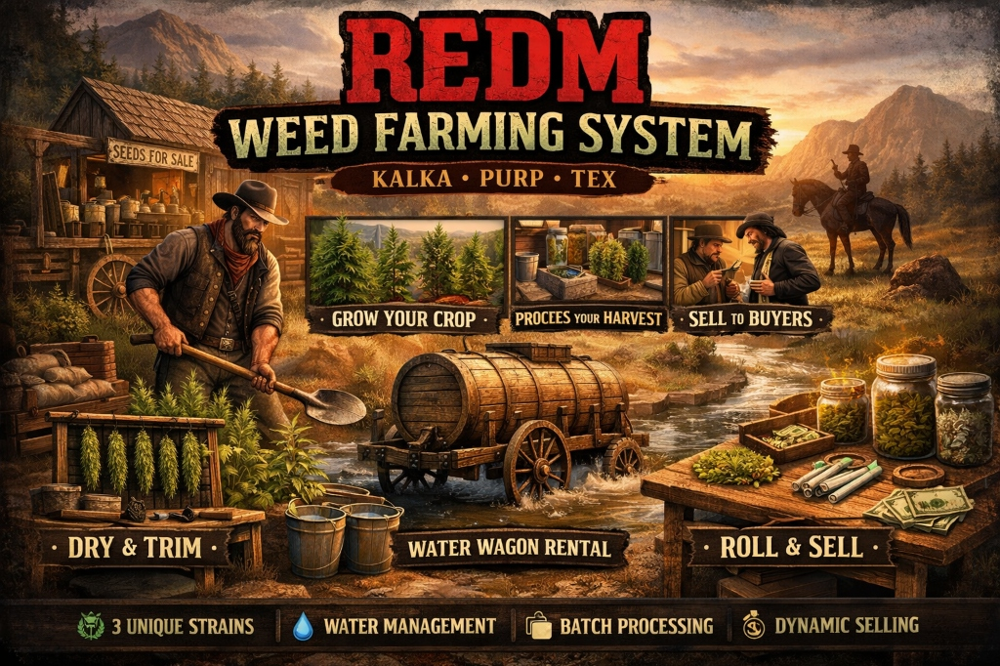

# RSG Weed - Advanced Farming System




A comprehensive weed farming system for RedM (RSG Core), featuring multi-stage growth, water management, batch processing, and a unique water wagon rental system.

## Features

### 🌿 Advanced Farming
- **3 Unique Strains**: Kalka (Guarma Gold), Purp (Ambarino Frost), Tex (New Austin Haze).
- **Growth Stages**: Seedling -> Young -> Mature.
- **Watering System**: Plants require water. Rent a water wagon or use buckets.
- **Visuals**: Props scale with growth and change models.

### 🚜 Water Wagon Rental
- Rent a **Water Wagon** from the Seed Vendor for $50.
- Holds **50 Litres** of water.
- Use it to fill your buckets anywhere on the farm.
- **Refillable**: Drive the wagon into a river/lake and "Refill Tank".
- Cinematic camera sequence upon rental.

### 🏭 Batch Processing
- **Washing**: Wash dirty leaves in the Wash Bucket. **Requires 50x Leaves**. Yields 46-49x Washed.
- **Drying**: Hang washed weed on the Drying Rack. **Requires 50x Washed**. Yields 46-49x Dried.
- **Trimming**: Trim dried buds at the table. **Requires 50x Dried**. Yields 46-49x Trimmed.
- **Loss Mechanic**: You always lose a small percentage during processing to simulate waste.

### 💰 Dynamic Selling
- Sell processed weed (Trimmed or Joints) to dynamic buyers in towns.
- Prices fluctuate based on strain and location.

## Configuration

Admins can adjust gameplay mechanics in `config.lua`.

### ⚙️ Main Settings
| Setting | Description | Default |
| :--- | :--- | :--- |
| `Config.GrowthTime` | Time in **minutes** for a plant to fully grow. | `25` |
| `Config.WaterRate` | Water loss per minute. Higher = faster drying. | `10.0` |
| `Config.HarvestAmount` | Range of items received when harvesting. | `{min=2, max=5}` |
| `Config.BucketUses` | How many times a water bucket can be used. | `10` |

### 👮 Police & Legal
| Setting | Description | Default |
| :--- | :--- | :--- |
| `Config.PoliceAlerts` | Enable/Disable alerts for illegal farming/selling. | `true` |
| `chance` | Percentage chance (1-100) to alert law. | `50` |
| `jobs` | List of job keys that receive alerts. | `['police', ...]` |

### 🚬 Smoking Buffs
| Setting | Description | Default |
| :--- | :--- | :--- |
| `jointHealthBoost` | Health restored per joint. | `10` |
| `jointStaminaBoost` | Stamina restored per joint. | `20` |
| `pipePuffs` | Number of puffs a pipe holds. | `10` |

## 💻 Installation

### 1. Dependencies
Ensure these resources are started **before** `rsg-weed` in your `server.cfg`:
- [`rsg-core`](https://github.com/Rexshack-RedM/rsg-core) - Core Framework
- [`rsg-inventory`](https://github.com/Rexshack-RedM/rsg-inventory) - Inventory System
- [`rsg-target`](https://github.com/Rexshack-RedM/rsg-target) - Targeting System
- [`ox_lib`](https://github.com/overextended/ox_lib) - UI & Utility Library

### 2. Item Setup
You need to add the weed items to your server's inventory system.
1. Open the file `items.lua` included in this resource.
2. Copy the content (the list of items).
3. Paste it into your core/inventory items file:
   - **RSG Core**: `rsg-core/shared/items.lua`
   - **Or**: If using a custom inventory config, verify where items are defined.

### 3. Database
**IMPORTANT**: The script does **NOT** create the database table automatically.
1. Locate the `install.sql` file in the main folder of this resource.
2. Open your database manager (HeidiSQL, DBeaver, etc).
3. **Import / Run** the `install.sql` file into your server's database.

### 4. Images
Inventory images are **required** for icons to show up.
1. Go to the `html/img/` folder inside this resource.
2. **Copy** all the `.png` files.
3. **Paste** them into your inventory's image folder:
   - Path: `rsg-inventory/html/images/`

### 5. Final Step
Add the resource to your `server.cfg`:
```cfg
ensure rsg-weed
```

## 📖 Player Guide

### 🧑‍🌾 Getting Started
1. **Visit the Vendor**: Head to the **Gardening Supplies** blip (near Valentine).
2. **Tools You Need**:
   - **Shovel**: For planting and harvesting.
   - **Water Bucket**: buy an Empty Bucket and fill it at a river, or rent a Water Wagon.
   - **Seeds**: Pick your strain (Kalka, Purp, or Tex).
   - **Fertilizer** (Optional): Speeds up growth.

### 🌱 Farming Cycle
1. **Planting**: Find a nice spot of soil and **Check for 'Use'** on your seed.
2. **Caring**:
   - **Watering**: Plants need water to grow! Use a **Full Bucket** or a **Water Wagon**.
   - **Fertilizing**: Use Fertilizer to give it a boost.
   - **Growth**: Plants have 3 visual stages. Wait for it to hit 100%. `Config.GrowthTime` is set to **25 minutes**.
3. **Harvesting**: Once fully grown, use your **Shovel** on the plant to harvest leaves.

### 🚜 Equipment: The Water Wagon
- Rent a **Water Wagon** from the vendor for $50.
- Holds **50 Litres** of water (enough for many plants).
- **Refill**: Drive the wagon into a river/lake and "Refill Tank".
- **Usage**: Walk to the back of the wagon with an empty bucket to fill it instantly.

### 🏭 Processing Your Harvest
Turn your raw leaves into sellable product. You need **50x Items** for each step.
1. **Washing**:
   - Buy and place a **Wash Bucket**.
   - Use Third-Eye to "Wash Leaves".
   - *50x Leaves -> 46-49x Washed Bud*.
2. **Drying**:
   - Buy and place a **Drying Rack**.
   - Use Third-Eye to "Dry Buds".
   - *50x Washed -> 46-49x Dried Bud*.
3. **Trimming**:
   - Use the **Drying Rack** again.
   - Use Third-Eye to "Trim Buds".
   - *50x Dried -> 46-49x Trimmed Bud*.

### 💰 Making Money: Street Dealing
Sell your product directly to locals in **Valentine, Rhodes, Saint Denis, or Blackwater**.
1. **Find a Buyer**: Look for civilian NPCs (not lawmen).
2. **Interact**: Use your Third-Eye (Alt) and select **"Sell Weed"**.
3. **Negotiate**:
   - They will make an offer.
   - **Lowballers**: ~30% of market value (40% chance).
   - **Normal**: Market value (50% chance).
   - **Highballers**: ~150% of market value (10% chance).
4. **Risk**: There is a **50% chance** a witness will call the law!

### 🚬 Smoking Features
Enjoy your own supply with immersive effects. **Requires Matches**.
- **Joints**:
  - Craft with `Trimmed Bud` + `Rolling Paper`.
  - Effect: Restores Health & Stamina. Screen blur effects.
  - **Animations**: unique enter/exit animations, changing stances (Male only).
- **Pipes**:
  - Buy a **Smoking Pipe**.
  - **Load It**: Use Third-Eye or Menu to load `Trimmed Bud`.
  - **Capacity**: 10 Puffs per load.
  - Drop key (Default B) to stop smoking.

### 👮 Legal Limits
- **Illegal Farming**: Growing more than **20 plants** triggers a major police alert ("Large Illegal Farm").
- **Selling**: Selling on the street risks police attention if witnessed.


### 📈 Dynamic Pricing
NPCs have different "moods" when buying:
- **Lowball (40% Chance)**: They offer **70% less** than market value.
- **Normal (50% Chance)**: Standard market price.
- **Highball (10% Chance)**: They really want it and pay **50% extra**.

**Editing**: You can adjust these percentages and chances in `client/selling.lua` (look for "Dynamic Pricing" around line 215).

### 💰 Price Configuration
There are two places to configure how much money you make:

1.  **Base Price (`config.lua`)**:
    *   Look for `Config.Selling.buyerPrices`.
    *   Here you set the **Minimum** and **Maximum** base price per joint.
    *   Example: `['joint'] = {min = 25, max = 35}` means a normal offer is between $25 and $35.
    *   **Note**: This price applies to **ALL** types of joints (Lemon Haze, Purple Haze, etc.). They all sell for the same potential price range.

2.  **Dynamic Logic (`client/selling.lua`)**:
    *   This applies the multiplier to the base price you set above.
    *   If you want to change the "Lowball" from 30% to 50%, or make them happen less often, edit the logic in `client/selling.lua` (around line 215).

## 🚀 Upcoming Updates
Stay tuned for future enhancements:
- **💊 Drug Making Options**: Advanced crafting for different types of drugs.
- **...and many more!**

## Credits
 **Weed Plant Props**: [DerHobbs](https://github.com/DerHobbs/Weed_plant_prop_for_RedM)
